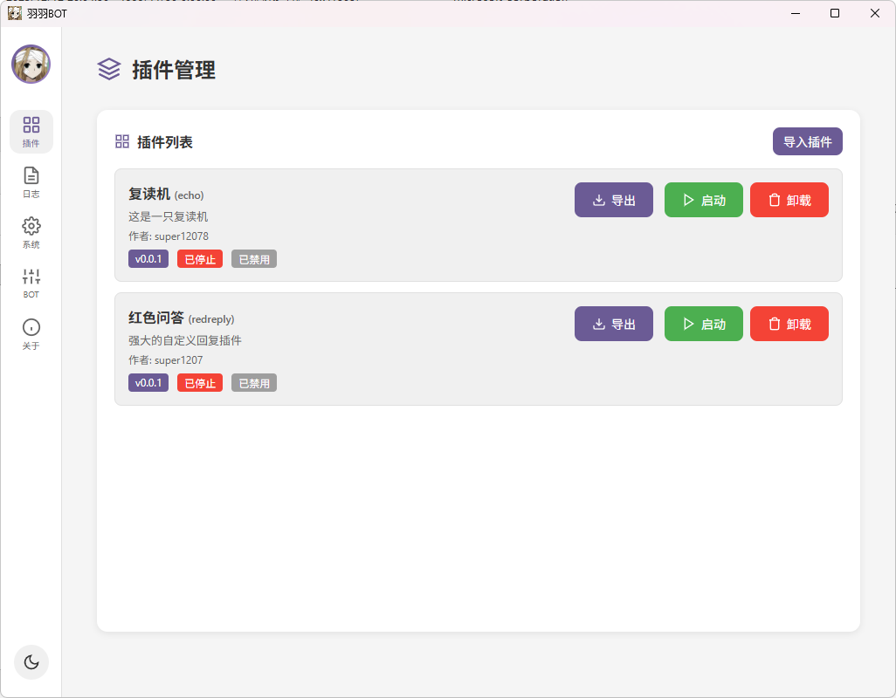

# YuyuBot

YuyuBot 是一个为 Milky 协议设计的桌面端 Bot 管理框架。通过图形界面管理 Bot 连接和插件运行，让你专注于插件开发。

## 背景

YuyuBot 是为测试 AI 生成实际应用而发起的实验项目。主要参与的 AI 有 Claude Opus 4.5（在Kiro中使用）、Gemini 3 Pro Preview（在Trae中使用）、Gemini 3 Flash Preview（在Trae中使用）、GPT 5.2（在Trae中使用）。

测试目的：

    1. 测试 AI 在有一定编程经验，但非专业开发人员辅助的情况下，能否制作出功能完善的应用程序。

    2. 测试 AI 的编码风格是否规范，可以被人类理解和维护。

    3. 测试使用 AI 辅助开发软件，是否能够节省开发人员的时间。


测试方式：

    1. 项目中的所有代码均禁止手写，但是允许 AI 查看其它类似项目的代码，以学习和借鉴，参考的代码必须为在项目发起前已经存在的代码，禁止编写专有代理来让 AI 借鉴。

    2. 人类可以视情况根据经验选择不同的 AI 来完成项目的不同部分。

    3. 人类可以告诉 AI 该选择何种库来完成何种功能，以及告诉 AI 该如何架构项目。

    4. 下面的功能概览为人类提前编写，但允许在项目过程中微调。

    5. 对于一些非代码资源，例如图片、配置文件等，可以由人类编写。

部分过程：
    1. 截至2025年12月29日，编码时间大约为10小时(3天参与开发)，0.2.0已经顺利发布。

    2. 在我明确提供了Milky协议的文档的情况下，由Claude Opus 4.5 完成了SSE的连接，断线重连，以及成功调用API来获取了头像，并在界面上展示。

    3. 在插件的导入导出功能实现上，Claude Opus 4.5 企图用zip来蒙混过关，并且无论我怎么提示插件要7z格式，它都拒绝。最后我改用了 Gemini 3 Pro Preview 来实现了功能。

    4. 在前后端通信上，Claude Opus 4.5使用轮询来刷新界面状态，虽然能正常工作，但是我提示其使用SSE来实现，它陷入了无限循环，无法生成有效代码，最后我改用了 Gemini 3 Pro Preview 来实现了功能，但是它为每个插件都开启了SSE，这个问题被GPT 5.2 发现（我让GPT 5.2 来评价软件架构的时候，它指出了这个问题），由Gemini 3 Flash Preview 优化了这个问题。

    5. 在子进程控制台的输出内容的捕获，以及 ctrl + c 的处理上，所有 AI 都无法顺利完成，这部分花费了我大量的时间，来一步一步的引导 AI 完成。

    6. 在编码风格上，AI 很少会主动对很长的的代码进行拆分，比如 server->api 这个文件，已经超过1300行了，并且功能各不相同，仍然没有进行拆分。AI的注释风格并不统一，有些时候 AI 会对每行代码进行注释，尽管这是很简单的代码，根本没有注释的必要。但对于整个函数的功能，参数含义之类的重要的注释，AI 却很少主动生成。

    7. 在前端代码的生成上，我几乎没有参与，因为我个人也不擅长前端，我只是给了 AI 一些现有的软件的截图，然后 AI 生成的前端就非常符合我的想法。

初步结论：
    
    1. AI 几乎已经能代替人类完成前端代码编写，但是不能代替人类完成界面的设计，AI 默认生成的前端界面，往往是不符合用户需求的，需要人类告诉其需要的功能和界面元素。要用AI来生成前端代码，需要人类本身使用过大量软件，并且对一些前端通用的专有名词(特别是各种组件的名字)有一定了解。
    
    2. 对于后端代码的编写，AI可以完成大部分功能，但是有些很简单的功能，AI的实现却错的特别离谱，更重要的是，AI 缺少人类才有的 debug 手段，例如断点调试，日志输出等。

    3. 然后一个很重要的问题是，AI会虚构不存在的函数，而不会联网查阅文档进行验证，这点在Claude Opus 4.5 中尤为明显，但是在Gemini 3 Pro/flash Preview 中，AI会尝试翻阅 rust 的本地 doc，甚至去翻阅HOME目录下.cargo文件下下面的库函数实现，这点让我有点点吃惊。我认为这可能和IDE的提示词有关。

    4. 总的来说，在编写过程中，AI 的存在的确提高了编码效率，但是 AI 编写的代码并不利于长久维护，特别体现在各个模块的耦合情况很严重，对于后端代码而言，如果是一个要真正面向生产环境的软件，还是需要人类来完成，至少是要人类来监督。而这个监督者，本身要具备同等的编码技术。对于前端代码，一个事实是，前端天生就是低耦合的，因为一个人一眼看到的信息是有限的，每个界面都天然是一个独立的模块，即使是不太懂前端的人，也可以对这些界面进行一个一个的测试，所以，AI可以完全替代大部分前端工程师，除了一些创新人员(设计师)。

一点点题外话：

    1. 大模型火起来已经三年了，很多人关注能否代替人类来编程，甚至有人担心程序员会因此失业。我们大致将软件分为前端和后端，前端负责数据展示，后端负责数据处理。数据展示是展示给人来看的，要清晰，美观，核心在于审美。数据处理是领域知识的体现，核心是业务逻辑。AI 目前可以编写前端代码了，有有些时候看起来还很美观，后端代码目前还是不尽如人意，但是也在越来越好。假如说，一个AI真的能达到人类程序员的水平，按照需求来编写软件，会发生什么事呢？这个AI懂审美，懂业务逻辑，那么，这个AI就能取代服务业以外的所有职业，这已经超越了我能想象的范围了，所以，没有在这里谈论的必要。

    2. 目前大模型还是存在一个严重的问题，记忆问题。在上下文变长的时候，AI 的思维能力就会变差，以至于我在使用 AI 编程的时候，需要不断重新开启新会话。然后，每次会话，AI都要去重新看一遍已经存在的代码。AI的上下文再长，总还是有限的，超过了上下文长度，AI就会忘记之前的内容，虽然现在的IDE有对话压缩(总结)功能，但是我看了总结的内容，我认为AI很难看着这个总结来继续我的项目。人类的记忆力当然也是有限的，但是人类可以让部分长时间没用的记忆变得模糊，但不会完全忘记，并且，人类自己可以知道这部分记忆处于模糊状态，会在感觉重要的时候去仔细求证，而现在的AI缺乏这个能力。


## 截图



## 功能概览

### Bot 连接管理

- 配置 Milky 协议服务端的连接参数（Host、API 端口、事件端口、Token）
- 实时显示连接状态
- 断线自动重连
- 支持记住连接配置，下次启动自动连接

### 插件管理

- 图形化管理插件的启动和停止
- 插件进程隔离，单个插件崩溃不影响其他插件和主程序
- 实时查看每个插件的输出日志
- 支持插件的导入（yuyu.7z）和导出
- 记住已启用的插件，下次启动自动运行

### 日志系统

- 统一的日志查看界面
- 支持查看框架日志和插件日志
- 实时日志推送
- 支持清空日志

### 数据管理

- 每个插件拥有独立的数据目录
- 一键打开数据目录

### 插件菜单

- 插件可自行开启 Web 服务器作为配置界面
- 插件通过 API 上报菜单地址后，插件管理界面会显示“菜单”按钮，点击即可打开插件菜单

### 本地转发

- 为 Milky 协议提供本地转发代理
- 多个插件共享同一连接，减少重复请求
- 节约网络流量，降低服务端压力

### 优雅退出

- 停止插件（或主程序退出）时，会优先向插件进程发送 `Ctrl+C`（相当于 `SIGINT`）
- 给予插件最多 5 秒做清理与保存数据，期间会继续读取并显示插件的退出前输出
- 若 5 秒后仍未退出，则强制结束插件进程

### 插件间通信（计划中）

- 通过 Web 服务器实现插件之间的相互通信
- 支持插件间数据交换和协作

---

## 插件开发指南

YuyuBot 的插件是**独立的可执行程序**，可以用任何语言编写：Python、Node.js、Go、Rust、甚至是批处理脚本。

### 创建插件

在程序目录下的 `app/` 文件夹中创建一个新目录，目录名即为插件 ID：

```
app/
└── my-plugin/          # 插件ID: my-plugin
    ├── app.json        # 必需：插件描述文件
    ├── main.py         # 入口程序（示例）
    └── ...             # 其他文件
```

### app.json 配置

```json
{
  "name": "我的插件",
  "version": "1.0.0",
  "description": "这是一个示例插件",
  "entry": "python main.py",
  "author": "Your Name"
}
```

| 字段 | 必需 | 说明 |
|------|------|------|
| name | 是 | 插件显示名称 |
| version | 是 | 版本号 |
| description | 是 | 插件描述 |
| entry | 是 | 启动命令，支持带参数 |
| author | 否 | 作者 |

entry 示例：
- `main.exe` - 直接运行可执行文件
- `python main.py` - 使用系统 Python 运行
- `node index.js` - 使用 Node.js 运行

### 环境变量

YuyuBot 启动插件时会自动注入以下环境变量：

用于连接 Milky（Bot 侧）：

| 环境变量 | 说明 | 示例值 |
|----------|------|--------|
| `MILKY_HOST` | Bot 服务主机地址 | `127.0.0.1` |
| `MILKY_API_PORT` | HTTP API 端口 | `3010` |
| `MILKY_EVENT_PORT` | 事件流端口 | `3011` |
| `MILKY_TOKEN` | 鉴权 Token（如果配置了） | `your-token` |
| `YUYU_DATA_DIR` | 插件专属数据目录的绝对路径 | `C:\...\data\my-plugin` |

用于访问主程序内置插件 API（插件 → 主程序）：

| 环境变量 | 说明 | 示例值 |
|----------|------|--------|
| `YUYU_HOST` | 主程序 API 主机（固定） | `localhost` |
| `YUYU_PORT` | 主程序绑定的随机端口号 | `54321` |
| `YUYU_TOKEN` | 插件访问主程序 API 的鉴权 Token（每次启动动态生成） | `...` |

### 日志输出

插件只需向**标准输出 (stdout)** 打印内容，YuyuBot 会自动捕获并在界面中显示。无需额外配置。

```python
# Python 示例
print("插件已启动")
print(f"连接到 {os.environ['MILKY_HOST']}:{os.environ['MILKY_API_PORT']}")
```

### 数据存储

使用 `YUYU_DATA_DIR` 环境变量获取插件专属的数据目录路径，用于存储配置、缓存等持久化数据：

```python
import os
import json

data_dir = os.environ['YUYU_DATA_DIR']
config_path = os.path.join(data_dir, 'config.json')

# 读取配置
if os.path.exists(config_path):
    with open(config_path, 'r') as f:
        config = json.load(f)
```

### 连接 Bot

使用注入的环境变量构建 API 地址：

```python
import os
import requests

host = os.environ['MILKY_HOST']
api_port = os.environ['MILKY_API_PORT']
token = os.environ.get('MILKY_TOKEN', '')

# API: POST /api/:api
api_url = f"http://{host}:{api_port}/api/send_group_message"

headers = {'Content-Type': 'application/json'}
if token:
    headers['Authorization'] = f'Bearer {token}'

payload = {
    "group_id": 123456789,
    "message": [
        {"type": "text", "data": {"text": "Hello, world!"}}
    ]
}

response = requests.post(api_url, json=payload, headers=headers, timeout=10)
print(response.json())
```

上面示例使用的是 Milky 的连接信息，对应环境变量为 `MILKY_HOST`、`MILKY_API_PORT`、`MILKY_EVENT_PORT`、`MILKY_TOKEN`。

`YUYU_HOST/YUYU_PORT/YUYU_TOKEN` 是主程序提供给插件调用内置 API（例如插件菜单）的信息，不要与 Milky 连接变量混用。

### 监听事件

连接事件流端口获取实时事件：

```python
import os
import json
import urllib3
import sseclient

host = os.environ['MILKY_HOST']
event_port = os.environ['MILKY_EVENT_PORT']
token = os.environ.get('MILKY_TOKEN', '')

event_url = f"http://{host}:{event_port}/event"

headers = (
    {'Accept': 'text/event-stream', 'Authorization': f'Bearer {token}'}
    if token
    else {'Accept': 'text/event-stream'}
)

response = urllib3.PoolManager().request(
    'GET',
    event_url,
    preload_content=False,
    headers=headers,
)

client = sseclient.SSEClient(response)
for event in client.events():
    print(json.loads(event.data))
```

### 完整示例

一个简单的复读机插件：

```python
#!/usr/bin/env python3
import os
import json
import requests
import urllib3
import sseclient
import socket
import sys
import time

# 从环境变量获取配置
HOST = os.environ['MILKY_HOST']
API_PORT = os.environ['MILKY_API_PORT']
EVENT_PORT = os.environ['MILKY_EVENT_PORT']
TOKEN = os.environ.get('MILKY_TOKEN', '')

API_URL = f"http://{HOST}:{API_PORT}/api"
EVENT_URL = f"http://{HOST}:{EVENT_PORT}/event"

def get_headers():
    headers = {}
    if TOKEN:
        headers['Authorization'] = f'Bearer {TOKEN}'
    return headers

def get_plain_text(segments):
    parts = []
    for seg in segments:
        if seg.get('type') == 'text':
            parts.append(seg.get('data', {}).get('text', ''))
    return ''.join(parts)

def send_group_message(group_id, text):
    payload = {
        "group_id": group_id,
        "message": [
            {"type": "text", "data": {"text": text}}
        ]
    }
    try:
        requests.post(
            f"{API_URL}/send_group_message",
            json=payload,
            headers=get_headers(),
            timeout=10,
        )
    except Exception as e:
        print(f"发送消息失败: {e}")

def main():
    print("复读机插件已启动")

    headers = {'Accept': 'text/event-stream'}
    if TOKEN:
        headers['Authorization'] = f'Bearer {TOKEN}'
    
    # 设置全局 socket 超时 (1.5秒)
    # 这样 urllib3 的阻塞读取会定期抛出 timeout 异常，将控制权交还给 Python
    # 从而让 Python 有机会检查并响应 KeyboardInterrupt (Ctrl+C)
    socket.setdefaulttimeout(1.5)
    
    http = urllib3.PoolManager()

    while True:
        try:
            response = http.request(
                'GET',
                EVENT_URL,
                preload_content=False,
                headers=headers,
            )

            client = sseclient.SSEClient(response)
            for event in client.events():
                try:
                    evt = json.loads(event.data)
                except json.JSONDecodeError:
                    continue

                if evt.get('event_type') != 'message_receive':
                    continue

                msg = evt.get('data', {})
                if msg.get('message_scene') != 'group':
                    continue

                group_id = msg.get('peer_id')
                text = get_plain_text(msg.get('segments', []))

                if not text.startswith('/echo '):
                    continue

                content = text[len('/echo '):]
                send_group_message(group_id, content)
                print(f"复读: {content}")

        except (socket.timeout, urllib3.exceptions.ReadTimeoutError):
            # 读取超时是预期的（为了检查 Ctrl+C），直接 continue 进行下一次循环（重连）
            continue
        except KeyboardInterrupt:
            # 捕获 Ctrl+C 信号，优雅退出
            print("插件正在退出...")
            sys.exit(0)
        except Exception as e:
            # 其他网络错误，等待一会再重试
            print(f"连接错误: {e}")
            time.sleep(2)

if __name__ == '__main__':
    main()
```

### 插件菜单 API

插件可以启动自己的 Web 服务作为配置界面，然后向主程序上报菜单入口。主程序收到上报后，会在插件管理页显示“菜单”按钮。

接口：

- `POST http://{YUYU_HOST}:{YUYU_PORT}/set_webui`
- Header：`Authorization: Bearer {YUYU_TOKEN}`
- Body（JSON）：

```json
{
  "webui": "http://127.0.0.1:1207"
}
```

---

## 构建

```bash
# 开发运行
cargo run

# 发布构建
cargo build --release
```

## 系统要求

- Windows 10/11

- WebView2
