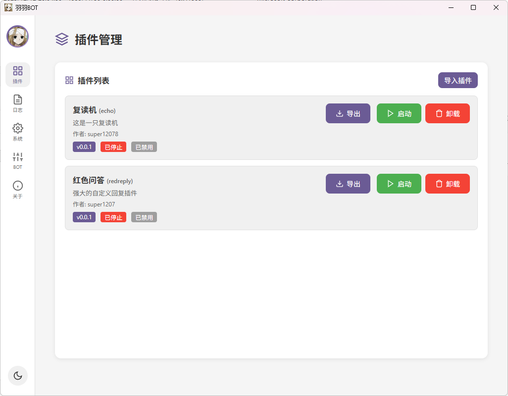

# YuyuBot

YuyuBot 是一个为 Milky 协议设计的桌面端 Bot 管理框架。通过图形界面管理 Bot 连接和插件运行，让你专注于插件开发。

## 背景

YuyuBot 是为测试 AI 生成实际应用而发起的实验项目。主要参与的 AI 有 Claude Opus 4.5（在 Kiro 中使用）、Gemini 3 Pro Preview（在 Trae 中使用）、Gemini 3 Flash Preview（在 Trae 中使用）、GPT 5.2（在 Trae 中使用）。

<details>
<summary>点击查看测试详情（目的、方式、过程及结论）</summary>

**测试目的：**

1. 测试 AI 在有一定编程经验、但非专业开发人员辅助的情况下，能否制作出功能完善的应用程序。
2. 测试 AI 的编码风格是否规范，是否能被人类理解和维护。
3. 测试使用 AI 辅助开发软件，是否能够节省开发人员的时间。

**测试方式：**

1. 项目中的所有代码均禁止手写，但允许 AI 查看其他类似项目的代码以学习和借鉴；参考代码必须为项目发起前已存在的代码，禁止编写专有代码让 AI 借鉴。
2. 人类可以视情况根据经验选择不同的 AI 完成项目的不同部分。
3. 人类可以告诉 AI 该选择何种库来完成何种功能，以及该如何架构项目。
4. 下方的功能概览为人类提前编写，但允许在项目过程中微调。
5. 对于一些非代码资源（例如图片、配置文件等），可以由人类编写。

**部分过程：**

1. 截至 2025 年 12 月 19 日，编码时间大约为 10 小时（3 天参与开发），`0.2.0` 已经顺利发布。
2. 在我明确提供了 Milky 协议文档的情况下，由 Claude Opus 4.5 完成了 SSE 的连接、断线重连，并成功调用 API 获取头像并在界面上展示。
3. 在插件的导入导出功能实现上，Claude Opus 4.5 试图用 ZIP 来蒙混过关，并且无论我怎么提示插件要 7z 格式，它都拒绝。最后我改用 Gemini 3 Pro Preview 实现了功能。
4. 在前后端通信上，Claude Opus 4.5 使用轮询刷新界面状态，虽然能正常工作，但在我提示其使用 SSE 后，它陷入了无限循环，无法生成有效代码。最后我改用 Gemini 3 Pro Preview 实现了功能，但它为每个插件都开启了 SSE。这个问题被 GPT 5.2 发现（我让 GPT 5.2 评价软件架构时指出了这个问题），由 Gemini 3 Flash Preview 优化解决。
5. 在子进程控制台输出内容的捕获，以及 `Ctrl+C` 的处理上，所有 AI 都无法顺利完成；这部分花费了我大量时间一步步引导 AI 完成。
6. 在编码风格上，AI 很少主动对很长的代码进行拆分，例如 `server->api` 文件已经超过 1300 行且功能各不相同，仍然没有拆分。AI 的注释风格也不统一：有时会对每行代码做注释（即使是很简单的代码），但对函数功能、参数含义等重要注释却很少主动生成。
7. 在前端代码生成上，我几乎没有参与：我只给了 AI 一些现有软件的截图，AI 生成的前端就非常符合我的想法。

**初步结论：**

1. AI 几乎已经能代替人类完成前端代码编写，但不能代替人类完成界面设计。AI 默认生成的界面往往不符合用户需求，需要人类明确指出需要的功能和界面元素。要用 AI 生成前端代码，需要人类本身使用过大量软件，并对一些前端通用术语（特别是组件名称）有一定了解。
2. 对于后端代码编写，AI 可以完成大部分功能，但也会把一些看似简单的功能实现得非常离谱；更重要的是，AI 缺少人类的 debug 手段，例如断点调试、日志输出等。
3. 一个很重要的问题是，AI 会虚构不存在的函数，而不会联网查阅文档进行验证；这点在 Claude Opus 4.5 中尤为明显。但在 Gemini 3 Pro/Flash Preview 中，AI 会尝试翻阅 Rust 的本地文档，甚至去翻阅 Home 目录下 `.cargo/` 目录中的库函数实现，这点让我有点吃惊。我认为这可能和 IDE 的提示词有关。
4. 总的来说，AI 的确提高了编码效率，但 AI 编写的代码不利于长期维护，尤其体现在模块耦合严重。对后端代码而言，若要面向生产环境，仍需要人类完成或至少严格监督（监督者本身要具备同等编码能力）。对前端代码而言，前端天生低耦合：人一眼能看到的信息有限，每个界面天然是独立模块，即使不太懂前端的人也可以逐个界面测试，因此 AI 可以替代大部分前端工程师，但仍需要创新人员（设计师）。

**一点题外话：**

1. 大模型火起来已经三年了，很多人关注它能否代替人类编程，甚至担心程序员会因此失业。我们大致将软件分为前端和后端：前端负责数据展示（核心在审美），后端负责数据处理（核心在业务逻辑）。AI 目前已经能编写前端代码，有些时候看起来还很美观；后端代码目前还不尽如人意，但也在越来越好。假如 AI 真的能达到人类程序员水平、按需求编写软件，那么它既懂审美又懂业务逻辑，可能取代服务业以外的许多职业，这已经超越了我能想象的范围，因此没有在这里展开讨论的必要。
2. 目前大模型还存在一个严重问题：记忆。在上下文变长时，AI 的思维能力会变差，以至于我在使用 AI 编程时需要不断开启新会话；而每次会话，AI 都要重新阅读已有代码。AI 的上下文再长也总是有限的，超过长度就会忘记之前内容。虽然现在的 IDE 有对话压缩（总结）功能，但我看过总结内容后，认为 AI 很难仅凭总结继续推进项目。人类的记忆力当然也有限，但人类会让部分久未使用的记忆变得模糊而非完全消失，并且能意识到这部分记忆处于模糊状态，在感觉重要时会仔细求证；而现在的 AI 缺乏这种能力。
</details>


## 截图



## 功能概览

### Bot 连接管理

- 配置 Milky 协议服务端的连接参数（Host、API 端口、事件端口、Token）
- 实时显示连接状态
- 断线自动重连
- 支持记住连接配置，下次启动自动连接

### 插件管理

- 图形化管理插件的启动和停止
- 插件进程隔离，单个插件崩溃不影响其他插件和主程序
- 实时查看每个插件的输出日志
- 支持插件的导入（yuyu.7z）和导出
- 记住已启用的插件，下次启动自动运行

### 日志系统

- 统一的日志查看界面
- 支持查看框架日志和插件日志
- 实时日志推送
- 支持清空日志

### 数据管理

- 每个插件拥有独立的数据目录
- 一键打开数据目录

### 插件菜单

- 插件可自行开启 Web 服务器作为配置界面
- 插件通过 API 上报菜单地址后，插件管理界面会显示“菜单”按钮，点击即可打开插件菜单

### 本地转发

- 为 Milky 协议提供本地转发代理
- 多个插件共享同一连接，减少重复请求
- 节约网络流量，降低服务端压力

### 优雅退出

- 停止插件（或主程序退出）时，会优先向插件进程发送 `Ctrl+C`（相当于 `SIGINT`）
- 给予插件最多 5 秒做清理与保存数据，期间会继续读取并显示插件的退出前输出
- 若 5 秒后仍未退出，则强制结束插件进程

### 插件间通信（计划中）

- 通过 Web 服务器实现插件之间的相互通信
- 支持插件间数据交换和协作

---

## 插件开发指南

YuyuBot 的插件是**独立的可执行程序**，可以用任何语言编写：Python、Node.js、Go、Rust、甚至是批处理脚本。

### 创建插件

在程序目录下的 `app/` 文件夹中创建一个新目录，目录名即为插件 ID：

```
app/
└── my-plugin/          # 插件ID: my-plugin
    ├── app.json        # 必需：插件描述文件
    ├── main.py         # 入口程序（示例）
    └── ...             # 其他文件
```

### app.json 配置

```json
{
  "name": "我的插件",
  "version": "1.0.0",
  "description": "这是一个示例插件",
  "entry": "python main.py",
  "author": "Your Name"
}
```

| 字段 | 必需 | 说明 |
|------|------|------|
| name | 是 | 插件显示名称 |
| version | 是 | 版本号 |
| description | 是 | 插件描述 |
| entry | 是 | 启动命令，支持带参数 |
| author | 否 | 作者 |

entry 示例：
- `main.exe` - 直接运行可执行文件
- `python main.py` - 使用系统 Python 运行
- `node index.js` - 使用 Node.js 运行

### 环境变量

YuyuBot 启动插件时会自动注入以下环境变量：

用于连接 Milky（Bot 侧）：

| 环境变量 | 说明 | 示例值 |
|----------|------|--------|
| `MILKY_HOST` | Bot 服务主机地址 | `127.0.0.1` |
| `MILKY_API_PORT` | HTTP API 端口 | `3010` |
| `MILKY_EVENT_PORT` | 事件流端口 | `3011` |
| `MILKY_TOKEN` | 鉴权 Token（如果配置了） | `your-token` |
| `YUYU_DATA_DIR` | 插件专属数据目录的绝对路径 | `C:\...\data\my-plugin` |

用于访问主程序内置插件 API（插件 → 主程序）：

| 环境变量 | 说明 | 示例值 |
|----------|------|--------|
| `YUYU_HOST` | 主程序 API 主机（固定） | `localhost` |
| `YUYU_PORT` | 主程序绑定的随机端口号 | `54321` |
| `YUYU_TOKEN` | 插件访问主程序 API 的鉴权 Token（每次启动动态生成） | `...` |

### 日志输出

插件只需向**标准输出 (stdout)** 打印内容，YuyuBot 会自动捕获并在界面中显示。无需额外配置。

```python
# Python 示例
print("插件已启动")
print(f"连接到 {os.environ['MILKY_HOST']}:{os.environ['MILKY_API_PORT']}")
```

### 数据存储

使用 `YUYU_DATA_DIR` 环境变量获取插件专属的数据目录路径，用于存储配置、缓存等持久化数据：

```python
import os
import json

data_dir = os.environ['YUYU_DATA_DIR']
config_path = os.path.join(data_dir, 'config.json')

# 读取配置
if os.path.exists(config_path):
    with open(config_path, 'r') as f:
        config = json.load(f)
```

### 连接 Bot

使用注入的环境变量构建 API 地址：

```python
import os
import requests

host = os.environ['MILKY_HOST']
api_port = os.environ['MILKY_API_PORT']
token = os.environ.get('MILKY_TOKEN', '')

# API: POST /api/:api
api_url = f"http://{host}:{api_port}/api/send_group_message"

headers = {'Content-Type': 'application/json'}
if token:
    headers['Authorization'] = f'Bearer {token}'

payload = {
    "group_id": 123456789,
    "message": [
        {"type": "text", "data": {"text": "Hello, world!"}}
    ]
}

response = requests.post(api_url, json=payload, headers=headers, timeout=10)
print(response.json())
```

上面示例使用的是 Milky 的连接信息，对应环境变量为 `MILKY_HOST`、`MILKY_API_PORT`、`MILKY_EVENT_PORT`、`MILKY_TOKEN`。

`YUYU_HOST/YUYU_PORT/YUYU_TOKEN` 是主程序提供给插件调用内置 API（例如插件菜单）的信息，不要与 Milky 连接变量混用。

### 监听事件

连接事件流端口获取实时事件：

```python
import os
import json
import requests

host = os.environ['MILKY_HOST']
event_port = os.environ['MILKY_EVENT_PORT']
token = os.environ.get('MILKY_TOKEN', '')

event_url = f"http://{host}:{event_port}/event"

headers = {'Accept': 'text/event-stream'}
if token:
    headers['Authorization'] = f'Bearer {token}'

response = requests.get(event_url, headers=headers, stream=True, timeout=(5, None))

for line in response.iter_lines(decode_unicode=False):
    if not line:
        continue
    
    line = line.decode('utf-8')
    
    if line.startswith('data:'):
        data = line[5:]
        try:
            evt = json.loads(data)
            print(evt)
        except json.JSONDecodeError:
            continue
```

### 完整示例

一个简单的复读机插件：

```python
#!/usr/bin/env python3
import os
import json
import requests
import time
import threading

# 从环境变量获取配置
HOST = os.environ['MILKY_HOST']
API_PORT = os.environ['MILKY_API_PORT']
EVENT_PORT = os.environ['MILKY_EVENT_PORT']
TOKEN = os.environ.get('MILKY_TOKEN', '')

API_URL = f"http://{HOST}:{API_PORT}/api"
EVENT_URL = f"http://{HOST}:{EVENT_PORT}/event"


def get_headers():
    headers = {'Accept': 'text/event-stream'}
    if TOKEN:
        headers['Authorization'] = f'Bearer {TOKEN}'
    return headers

def get_plain_text(segments):
    parts = []
    for seg in segments:
        if seg.get('type') == 'text':
            parts.append(seg.get('data', {}).get('text', ''))
    return ''.join(parts)

def signal_handler(sig, frame):
    print("\n插件正在退出...")
    os._exit(0)

def send_group_message(group_id, text):
    payload = {
        "group_id": group_id,
        "message": [{"type": "text", "data": {"text": text}}]
    }
    try:
        requests.post(
            f"{API_URL}/send_group_message",
            json=payload,
            headers={'Authorization': f'Bearer {TOKEN}'} if TOKEN else {},
            timeout=10,
        )
    except Exception as e:
        print(f"发送消息失败: {e}")

def handle_group_message(msg):
    group_id = msg.get('peer_id')
    text = get_plain_text(msg.get('segments', []))

    if not text.startswith('/echo '):
        return

    content = text[len('/echo '):]
    send_group_message(group_id, content)
    print(f"复读: {content}")

def event_loop():
    while True:
        try:
            response = requests.get(
                EVENT_URL,
                headers=get_headers(),
                stream=True,
                timeout=(5, None)
            )

            print("已连接到事件流，等待消息...")

            for line in response.iter_lines(chunk_size=1, decode_unicode=False):
                if not line:
                    continue

                line = line.decode('utf-8')

                if line.startswith('data:'):
                    data = line[5:]
                    try:
                        evt = json.loads(data)
                    except json.JSONDecodeError:
                        continue

                    print(f"收到事件: {line}")

                    if evt.get('event_type') != 'message_receive':
                        continue

                    msg = evt.get('data', {})
                    if msg.get('message_scene') != 'group':
                        continue

                    handle_group_message(msg)

        except Exception as e:
            print(f"连接错误: {e}")
            time.sleep(2)

def main():
    import signal
    signal.signal(signal.SIGINT, signal_handler)

    print("复读机插件已启动")
    print(f"连接到: {EVENT_URL}")

    worker = threading.Thread(target=event_loop, daemon=True)
    worker.start()
    worker.join()

if __name__ == '__main__':
    main()
```

### 插件菜单 API

插件可以启动自己的 Web 服务作为配置界面，然后向主程序上报菜单入口。主程序收到上报后，会在插件管理页显示“菜单”按钮。

接口：

- `POST http://{YUYU_HOST}:{YUYU_PORT}/set_webui`
- Header：`Authorization: Bearer {YUYU_TOKEN}`
- Body（JSON）：

```json
{
  "webui": "http://127.0.0.1:1207"
}
```

---

## 构建

```bash
# 开发运行
cargo run

# 发布构建
cargo build --release
```

## 系统要求

- Windows 10/11

- WebView2

- VC++ 14 Runtime 


## YuyuBot 项目架构分析

YuyuBot 是一个专门为运行 Bot 和各类插件而设计的桌面客户端。整体架构采用了类似 Tauri 的 **"Rust 后端 + WebView 前端"** 模式，但它是通过直接组合底层的 `wry`、`tao` 和 `rocket` 来实现的，并在底层实现了复杂的进程管理和网络代理机制。

以下是详尽的架构解析：

## 1. 整体技术栈与系统级设计

### 前端与 GUI 宿主
* **WebView 渲染**：采用 `wry` 提供原生的 WebView 以渲染打包进二进制的静态前端（通过 `rust-embed` 实现资源嵌入，无需附带额外文件）。
* **窗口与事件引擎**：使用 `tao` 作为跨平台窗口构建和事件循环管理引擎。
* **系统交互**：使用 `tray-icon` 实现 Windows 右下角托盘交互及后台运行。项目配置了 `winres` 附加图标，并使用了 Windows API（`windows-sys`）实现了单实例检测（`CreateMutexW`），且在重复启动时主动唤醒已有的后台实例。

### 后端运行时与网络框架
* **异步运行时**：`Tokio` 提供底层的全异步运行时。
* **Web/API 服务器**：`Rocket (0.5.1)` 作为核心的 Web/API 服务器框架。由于主要跑在本地，配置了随机端口（`main_port = 0`），并将实际监听端口回传给插件系统。

---

## 2. 插件生命周期管理（核心亮点）

项目的核心价值在于对第三方插件的管理与调度：

* **Pty / 虚拟终端支持 (`expectrl`)**：
  * YuyuBot 没有简单地使用 `std::process::Command`，而是专门引入了 `expectrl` 库来创建 **PTY（伪终端）** 会话。
  * 这意味着由 YuyuBot 启动的子插件/子进程会有原生的终端输出体验（特别是对于 Node.js 或 Python 编写的子进程，能防止因管道缓冲问题导致的日志延迟）。
  * 使用了 `strip_ansi_escapes` 来清理子进程输出中的终端颜色代码，然后再将纯净文本通过 `tokio::sync::broadcast` 推送给前端。
* **环境隔离与优雅退出**：
  * 在启动子进程时，会创建一个临时的运行目录 (`run_tmp_dir`)。
  * 在请求停止进程时，代码通过专门的函数尝试发送 `Ctrl+C` 信号进行优雅关闭。
* **配置与目录**：
  * 所有的插件存放在 `app/` 目录下。启动时，`load_plugins` 会遍历此目录加载并读取插件的元数据。

---

## 3. Milky Proxy (Bot 事件与 API 中继架构)

这可以说是项目中最复杂的一环，采用了类似**中间件总线**的设计模式。YuyuBot 本身并不是 Bot，它是一个**客户端网关**。

### 数据流拓扑图

```text
实际的 Bot 平台端点 (Host:Port)  <--->  YuyuBot (BotConnectionState)
                                       |
             +-------------------------+-------------------------+
             |                     (内部转发)                    |
  Milky Proxy (API Port)                              Milky Proxy (Event Port)
             |                                                   |
   +---------+---------+                               +---------+---------+
   |         |         |                               |         |         |
Plugin1   Plugin2   PluginN                         Plugin1   Plugin2   PluginN
```

### 设计初衷与实现
* **解决痛点**：如果所有的子插件直接连接真正的 Bot 端点，可能会引起端口竞争、重复鉴权以及流量重复消耗。
* **双代理服务**：YuyuBot 在启动时利用 `Rocket` 起了另外两个服务：**Milky Proxy API 服务器** 和 **Milky Proxy Event 服务器**。
* **参数传递**：当启动子插件（通过 `expectrl`）时，YuyuBot 会通过环境变量，把自己的 Milky Proxy 地址、随机生成的 API Token 传递给子进程。
* **权限与分发**：子进程只需向这个本地代理发送请求，代理模块会对插件进行权限验证（`PluginAuth` 依赖请求头），然后代发给真实的 Bot 服务器，最后将事件**多播分发**给每个插件。

---

## 4. 数据与状态管理

项目中广泛使用了 `tokio::sync::RwLock`、`Arc`、`AtomicBool` 和 `AtomicU16` 进行线程安全的内存状态管理，具体包括：

* **`ServerState`**：保存了主事件循环的 Proxy 句柄以及插件管理器引用。
* **`BotConnectionState`**：管理与真实 Bot 端点的连接状态和并发控制（如连接 Task、取消 Sender）。
* **SSE / WebSocket 推送**：针对如“运行日志”、“插件状态”等高频推送需求，利用了 Rocket 的 EventStream (`SseMessage`) 实现流式推送给 Web 前端。

---

## 架构总结

YuyuBot 是一个**带可视化面板的本地反向代理与进程管理器**。

1. **表现层**：最外层用 `Tao`/`Wry` 包装了一个轻量级本地 Web 界面。
2. **控制与网络层**：中间层使用 `Rocket`/`Tokio` 构建了一个高度灵活的本地服务器，除了服务 Web 前端的控制请求，最主要的功能是承担 **"Milky Proxy"** 中继器的角色。
3. **核心执行层**：最底层使用 `expectrl` 提供了对子插件进程的无缓冲标准输出捕捉与安全管理，并借由代理服务器拦截并分配 Bot 数据。

> **💡 适用场景：** 这个架构非常适合需要在本地长期挂载、由多个松耦合的扩展工具（比如 AI 回复、自动管理等不同语言编写的独立进程）共同协作的 Bot 运维场景。